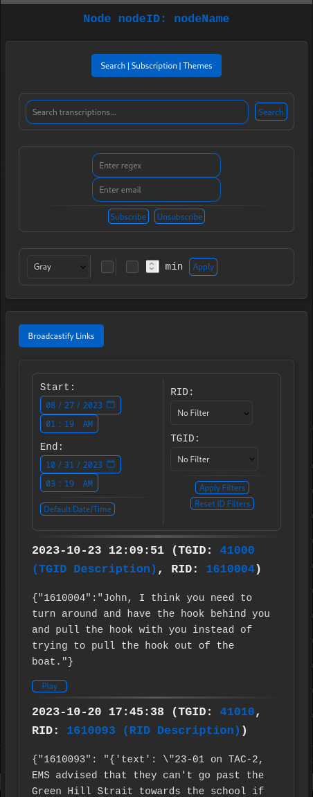
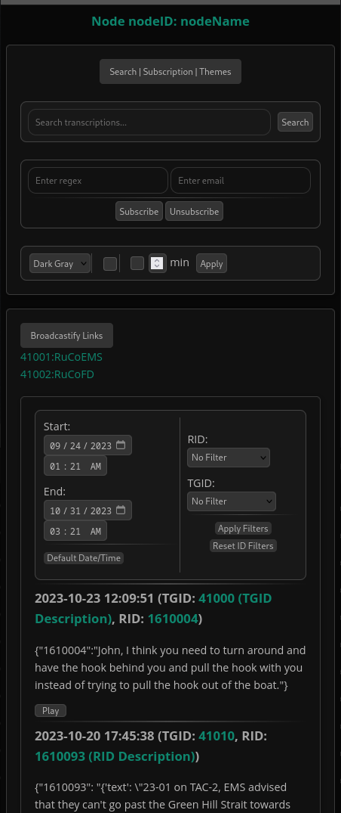

# sdrtrunk-transcribed-web

Node.JS website to display audio and transcriptions from one of the following apps:
- [sdrtrunk-transcriber](https://github.com/swiftraccoon/sdrtrunk-transcriber) (Python)
- [cpp-sdrtrunk-transcriber](https://github.com/swiftraccoon/cpp-sdrtrunk-transcriber) (C++)

## Overview

This web application is designed to serve transcriptions of audio files. It's built using Node.js with the Express framework and utilizes various other libraries and utilities. 
It's themed to be used on a mobile device or to take up very little width and be expanded length wise on the desktop so that you can leave it up without taking up much footprint.

### Features
- **Basic Authentication**: Secured with basic HTTP authentication.
- **File Filtering**: Filter audio files based on Radio IDs, Talkgroup IDs, and date ranges.
- **Transcriptions**: Display corresponding transcriptions generated by an AI system.
- **Transcription Searching**: Enter a regex or words to filter for on transcriptions.
- **Transcription Subscribing**: Enter a regex and whenever text that matches is found, send an e-mail. 
- **Theming**: Customize the appearance with different themes.
- **Auto-Refresh**: Auto-refresh at a user-defined interval.
- **Robots Exclusion**: Prevents web crawlers from indexing the application.

## Dependencies
- `express`: Web framework for Node.js
- `fs`: Node.js built-in file system module
- `moment-timezone`: For date and time manipulation
- `path`: Node.js built-in path module
- `express-basic-auth`: For basic HTTP authentication
- `cookie-parser`: Middleware for parsing cookies
- `sqlite3`: SQLite database for subscriptions
- `nodemailer`: For sending email notifications

## Installation and Running
1. Clone the repository.
2. Run `npm install` to install dependencies.
3. Rename `example.config.js` to `config.js` and update the configuration settings.
4. Utilize Let's Encrypt or generate your own: `openssl req -nodes -new -x509 -keyout server.key -out server.cert`
6. Start the server using `node server.js`.
7. Access the application at `https://localhost:3000`.

## API Endpoints
- `GET /`: Main route for filtering and sorting audio files and their transcriptions.
- `POST /subscribe`: Subscribe to email notifications.
- `POST /unsubscribe`: Unsubscribe from email notifications.
- `GET /verify/:id`: Verify email for subscription.
- `GET /search`: Search transcriptions.

## Contributing
Feel free to open issues and pull requests.

## Preview
 
